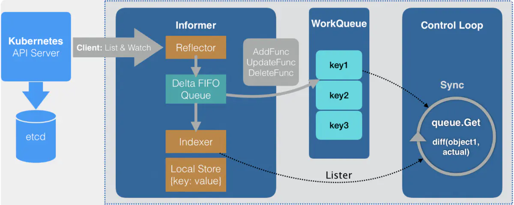

# Informer机制

在Kubernetes中组件之间通过HTTP协议通信，在不依赖任何中间件的情况下需要保证消息的实时性、可靠性、顺序性等，那就需要用到Informer机制。Kubernetes的其他组件都是通过client-go的Informer机制与Kubernetes API Server进行通信的。

Informer 中主要有 Reflector、Delta FIFO Queue、Local Store、WorkQueue 几个组件。以下是 Informer 的工作流程图。



**Informer是一个持续运行的goroutine**

Informer 是 Client-go 中的一个核心工具包。在 Kubernetes 源码中，如果 Kubernetes 的某个组件，需要 List/Get Kubernetes 中的 Object，在绝大多 数情况下，会直接使用 Informer 实例中的 Lister()方法（该方法包含 了 Get 和 List 方法），而很少直接请求 Kubernetes API。Informer 最基本 的功能就是 List/Get Kubernetes 中的 Object。

## Informer机制架构设计
在Informer的架构设计中有多个核心组件，分别介绍如下：
1.Reflector
Reflector用于监控（Watch）指定的Kubernetes资源，当监控的资源发生变化时，触发相应的变更事件，例如Add，Update，Delete事件，并将其资源对象存放到本地缓存DeltaFIFO中。

2.DeltaFIFO
FIFO是一个先进先出的队列，而Delta是一个资源对象存储，它可以保存资源对象的操作类型，例如Added，Updated，Deleted，Sync操作类型等。

3.Indexer
Indexer是client-go用来存储资源对象并自带索引功能的本地存储，Reflector从DeltaFIFO中将消费出来的资源对象存储到Indexer中。Indexer与Etcd集群中的数据完全保持一致。client-go可以方便的从本地存储中读取相应的资源对象数据，而无须每次从远程Etcd集群中读取。

## Informer机制中的关键点
1.更快地返回 List/Get 请求，减少对 Kubenetes API 的直接调用
使用 Informer 实例的 Lister() 方法， List/Get Kubernetes 中的 Object 时，Informer 不会去请求 Kubernetes API，而是直接查找缓存在本地内存中的数据(这份数据由 Informer 自己维护)。通过这种方式，Informer 既可以更快地返回结果，又能减少对 Kubernetes API 的直接调用。

2.依赖 Kubernetes List/Watch API
Informer 只会调用 Kubernetes List 和 Watch 两种类型的 API。Informer 在初始化的时，先调用 Kubernetes List API 获得某种 resource 的全部 Object，缓存在内存中; 然后，调用 Watch API 去 watch 这种 resource，去维护这份缓存; 最后，Informer 就不再调用 Kubernetes 的任何 API。

3.可监听事件并触发回调函数
Informer 通过 Kubernetes Watch API 监听某种 resource 下的所有事件。而且，Informer 可以添加自定义的回调函数。

4.二级缓存
二级缓存属于 Informer 的底层缓存机制，这两级缓存分别是 DeltaFIFO 和 LocalStore。这两级缓存的用途各不相同。DeltaFIFO 用来存储 Watch API 返回的各种事件 ，LocalStore 只会被 Lister 的 List/Get 方法访问 。虽然 Informer 和 Kubernetes 之间没有 resync 机制，但 Informer 内部的这两级缓存之间存在 resync 机制。

## Reflector
Reflector的源码实现中最重要的是ListAndWatch函数，它负责获取资源列表（List）和监控（Watch）指定的Kubernetes API Server资源。

1. List

List在第一次运行时会获取该资源对象数据并将其存储至DeltaFIFO中，List的主要流程：

（1) r.listerWatcher.List用于获取资源下的所有对象的数据。

（2) listMetaInterface.GetResourceVersion用于获取资源版本号，ResourceVersion非常重要，它标志当前资源对象的版本号，每次修改当前资源时API Server都会更改ResourceVersion，这样client-go在执行Watch操作时可以根据ResourceVersion来确定当前资源对象是否发生变化。

（3）meta.ExtractList用于将资源转化成资源对象列表，将runtime.Object对象转化成[]runtime.Object对象。

（4）r.syncWith将资源对象列表中的资源对象和资源版本号存储至DeltaFIFO中，并替换已有的对象。

（5）r.setLastSyncResourceVersion设置最新的资源版本号。

2. Watch

Watch通过HTTP协议与Kubernetes API Server建立长连接，接收Kubernetes发来的资源变更事件。Watch使用的HTTP协议的分块传输编码（Chunked Transfer Encoding）。当client-go调用Kubernetes API Server时，API Server会在Response中的HTTP Header中设置Transfer-Encoding的值为Chunked，客户端收到该消息后，便于服务端进行连接，并等待下一个数据块（即资源的事件信息）。

## DeltaFIFO

DeltaFIFO和其他队列最大的不同就是它会保留所有关于资源对象（obj）的操作类型。

DeltaFIFO结构示例代码如下：

```
type DeltaFIFO struct {
    ...
    items map[string]Deltas
    queue []string
    ...
}
type Deltas []Delta
```

DeltaFIFO的存储结构如下：
queue  ObjKey1 | ObjKey2 | ObjKey3
items  ObjKey1: [{"Added", Obj1}, {"Updated", Obj1}]
       ObjKey2: [{"Added", Obj2}, {"Deleted", obj2}, {"Updated", obj1}]
       ObjKey3: [{"Added", Obj3}, {"Updated", obj3}, {"Deleted", obj3}]

DeltaFIFO本质上是一个先进先出的队列，有数据的生产者和消费者，其中生产者是Reflector调用的Add方法，消费者是Controller调用的Pop方法。

## Indexer

通过Indexer Example理解Indexer:
```
package main

import (
    "fmt"
    "strings"

    "k8s.io/api/core/v1"
    metav1 "k8s.io/apimachinery/pkg/apis/meta/v1"
    "k8s.io/client-go/tools/cache"
)

func UsersIndexFunc(obj interface{}) ([]string, error) {
    pod := obj.(*v1.Pod)
    usersString := pod.Annotations["Users"]

    return strings.Split(userString, ","), nil
}

func main() {
    index := cache.NewIndexer(cache.MetaNamespaceKyeFunc,
        cache.Indexers{"byUser": UsersIndexFunc})

    pod1 := &v1.Pod{ObjectMeta: metav1.ObjectMeta{Name: "one",
        Annotations: map[string]string{"users": "ernie,bert"}}}
    pod2 := &v1.Pod{ObjectMeta: metav1.ObjectMeta{Name: "two",
        Annotations: map[string]string{"users": "bert,oscar"}}}
    pod3 := &v1.Pod{ObjectMeta: metav1.ObjectMeta{Name: "tre",
        Annotations: map[string]string{"users": "ernie,elmo"}}}

    index.Add(pod1)
    index.Add(pod2)
    index.Add(pod3)

    erniePods, err := index.ByIndex("byUser", "ernie")
    if err != nil {
        panic(err)
    }

    for _, erniePod := range erniePods {
        fmt.Println(erniePod.(*v1.Pod).Name)
    }
}
```
